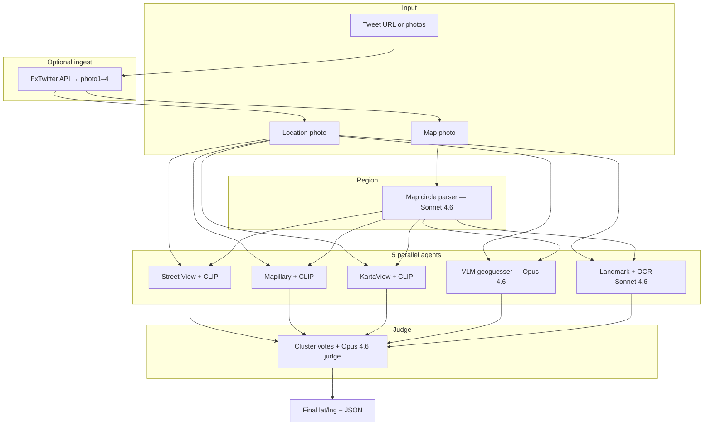

# doordash-geo-hunt

Multi-agent geolocation pipeline for DoorDash FIFA ticket contest drops.

Given a **map photo** (red warm-zone circle) and a **location photo** (bag on pedestal + background clues), the system runs **5 agents in parallel**, then a **judge** picks the final lat/lng.

## Quick start (contest day)

```powershell
# From a tweet URL — ingest photos + run full pipeline
python cli.py ingest "https://x.com/DoorDash/status/TWEET_ID" --out samples/live-drop --run --tweet-id
```

DoorDash posts **4 photos** per drop. This project uses:

| File | Role |
|------|------|
| `photo1.jpg` | Promo (ignore) |
| **`photo2.jpg`** | **Map / warm zone** |
| **`photo3.jpg`** | **Location clue** |
| `photo4.jpg` | Promo (ignore) |

**Phone workflow:** paste tweet URL + prompt from [`.cursor/agents/contest-day-prompt.txt`](.cursor/agents/contest-day-prompt.txt) into [cursor.com/agents](https://cursor.com/agents). In parallel, attach photos 2+3 in Cursor chat (Opus 4.8) for a faster first pin.

---

## Architecture



### Agents

| Agent | Method | API |
|-------|--------|-----|
| **streetview_matcher** | Grid inside circle → Google Street View → CLIP similarity | `GOOGLE_MAPS_API_KEY` |
| **mapillary_matcher** | Bbox street photos → CLIP | `MAPILLARY_ACCESS_TOKEN` |
| **kartaview_matcher** | OpenStreetCam nearby photos → CLIP | None (public API) |
| **vlm_geoguesser** | Vision LLM reads scene → lat/lng inside circle | Bedrock / Azure / Gemini |
| **landmark_ocr** | EasyOCR + vision LLM POI matching | Bedrock / Azure / Gemini |

### Judge

1. Drop candidates outside the search circle  
2. Cluster pins within ~40 m; boost multi-agent agreement  
3. Fetch Street View metadata at top candidates  
4. Opus-tier vision LLM picks final coordinates from agent summaries + location photo  

### Vision LLM routing (`llm_vision.py`)

Tiered by step (configurable via env):

| Step | Default model tier |
|------|-------------------|
| Map circle | **Sonnet 4.6** |
| Landmark + OCR | **Sonnet 4.6** |
| VLM geoguesser | **Opus 4.6** (falls back to Opus 4.5 on Bedrock if 4.6 unavailable) |
| Judge | **Opus 4.6** (same fallback) |

Set `VISION_LLM_PROVIDER=bedrock` (recommended), `gemini`, `azure_openai`, `openai`, or `anthropic`. See [`.env.example`](.env.example).

---

## Setup

**Requires Python 3.10+** (3.11 recommended).

```powershell
cd C:\Users\91767\Projects\doordash-geo-hunt

# Option A: conda (recommended on Windows)
conda create -n geo-hunt python=3.11 -y
conda activate geo-hunt

# Option B: venv
python -m venv .venv
.\.venv\Scripts\Activate.ps1

pip install -e .
copy .env.example .env
# Edit .env with your API keys
```

Verify keys:

```powershell
python scripts/test_apis.py
```

---

## Configuration

Copy [`.env.example`](.env.example) → `.env`. Minimum for Bedrock pipeline:

```env
VISION_LLM_PROVIDER=bedrock
GOOGLE_MAPS_API_KEY=...
MAPILLARY_ACCESS_TOKEN=...
AWS_BEARER_TOKEN_BEDROCK=...
AWS_BEDROCK_REGION=us-east-1
AWS_BEDROCK_SONNET_MODEL_ID=us.anthropic.claude-sonnet-4-6
AWS_BEDROCK_OPUS_MODEL_ID=us.anthropic.claude-opus-4-6
AWS_BEDROCK_OPUS_FALLBACK_MODEL_ID=us.anthropic.claude-opus-4-5-20251101-v1:0
```

| Key | Used by |
|-----|---------|
| `GOOGLE_MAPS_API_KEY` | Street View grid, judge metadata |
| `MAPILLARY_ACCESS_TOKEN` | Mapillary CLIP agent |
| `AWS_BEARER_TOKEN_BEDROCK` | All vision LLM steps (when `VISION_LLM_PROVIDER=bedrock`) |
| KartaView | No key — public API |
| `GEMINI_API_KEY` | Alternative vision provider |
| `AZURE_OPENAI_*` | Alternative vision provider (deploy Sonnet + Opus) |

**Never commit `.env`** — it is gitignored.

---

## Run

### Tweet ingest + pipeline (one command)

```powershell
python cli.py ingest "https://x.com/DoorDash/status/TWEET_ID" `
  --out samples/live-drop `
  --run `
  --tweet-id
```

Uses **FxTwitter / VxTwitter API** — does not scrape x.com in a browser.

### Ingest only

```powershell
python cli.py ingest "https://x.com/DoorDash/status/TWEET_ID" --out samples/live-drop
```

### Manual photos

```powershell
python cli.py run `
  --map samples/miami-drop1/photo2.jpg `
  --location samples/miami-drop1/photo3.jpg `
  --city Miami `
  --output-json output/miami-drop1.json
```

### Skip map LLM (manual circle)

```powershell
python cli.py run `
  --map samples/miami-drop1/photo2.jpg `
  --location samples/miami-drop1/photo3.jpg `
  --center-lat 25.814 `
  --center-lng -80.197 `
  --radius-m 800 `
  --output-json output/manual.json
```

Legacy syntax still works: `python cli.py --map ... --location ...`

---

## Contest day (phone + cloud)

1. **Push repo to GitHub** and connect it in [Cursor Cloud Agents](https://cursor.com/dashboard).  
2. Add **cloud secrets** matching your `.env` keys.  
3. On [cursor.com/agents](https://cursor.com/agents), start an agent on this repo.  
4. Paste [`.cursor/agents/contest-day-prompt.txt`](.cursor/agents/contest-day-prompt.txt) with the tweet URL.  
   - **Do not** ask the agent to open x.com — it must run `cli.py ingest`.  
5. **In parallel:** Cursor chat (Opus 4.8) with saved photos 2+3 for a fast pin.

Optional webhook automation: [`.cursor/automation/door-dash-drop.json`](.cursor/automation/door-dash-drop.json)

---

## Output

- Console report with per-agent top candidates  
- `output/<tweet_id>.json` (with `--tweet-id`) or `output/result.json`  
- Google Maps link printed at the end  

Example structure:

```json
{
  "region": { "center_lat": 25.814, "center_lng": -80.197, "radius_m": 800 },
  "agents": [ ... ],
  "verdict": { "lat": 25.8142, "lng": -80.1969, "confidence": 0.88 }
}
```

---

## Samples

| Folder | Description |
|--------|-------------|
| `samples/miami-drop1/` | Design District drop (tweet `2067973011781607579`) |
| `samples/miami-drop2/` | Brickell drop (tweet `2068028794883997721`) |
| `samples/live-drop/` | Default output for contest-day ingest |

Test on Miami drop 1:

```powershell
python cli.py run `
  --map samples/miami-drop1/photo2.jpg `
  --location samples/miami-drop1/photo3.jpg `
  --city Miami `
  --output-json output/2067973011781607579.json
```

---

## Scripts

| Script | Purpose |
|--------|---------|
| `scripts/test_apis.py` | Smoke-test all API keys |
| `scripts/probe_models.py` | Test Bedrock vision models |
| `scripts/probe_bedrock_models.py` | Quick Bedrock model ID probe |
| `scripts/trigger-drop-webhook.ps1` | POST tweet URL to automation webhook |

---

## Known limitations

- **Opus 4.6** may not be available on all Bedrock accounts — auto-falls back to Opus 4.5.  
- **CLIP visual matchers** can fail on some Windows setups (torchvision threading); LLM agents still run.  
- **KartaView CDN** often 404/502 in Miami — agent returns empty gracefully.  
- **Tweet ingest** requires FxTwitter/VxTwitter; if down, save photos manually from the X app.  
- **Gemini free tier** may hit quota (429) — use Bedrock as primary.

---

## Cost tips

- Use `--center-lat/lng/radius` to skip map vision LLM call  
- Increase Street View grid step in `streetview.py` to reduce API calls  
- Sonnet for map/OCR + Opus for geoguesser/judge is the default cost/quality balance  

---

## Project layout

```
cli.py                          # Entry point
src/doordash_geo_hunt/
  orchestrator.py               # Parallel agent runner + judge
  twitter_fetcher.py            # Tweet → photo1–4 via FxTwitter
  llm_vision.py                 # Tiered vision LLM router
  map_extractor.py              # Map circle → SearchRegion
  agents/visual_matcher.py      # CLIP matchers (Street View, Mapillary, KartaView)
  agents/vlm_agents.py          # Geoguesser + landmark/OCR
  judge/judge_agent.py          # Vote cluster + final pick
  matching/clip_matcher.py      # Local CLIP embeddings
.cursor/agents/                 # Contest-day cloud agent prompt
.cursor/automation/             # Webhook automation prefill
samples/                        # Miami test drops
```

---

## License

Private / personal use. API keys and contest photos are your responsibility.
