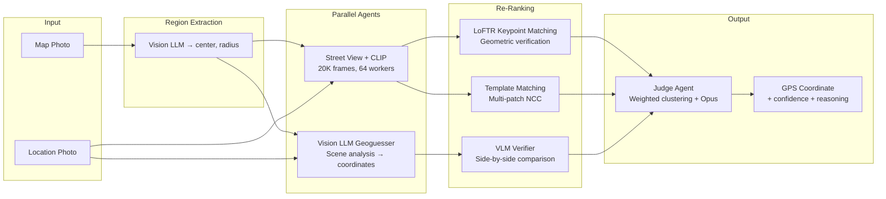

# GeoHunt: Multi-Agent Visual Geolocation Pipeline

**Pinpoint a real-world location from a single photo in under 90 seconds.**

GeoHunt is an automated geolocation system that combines CLIP visual search, LoFTR keypoint matching, multi-patch template matching, and Vision LLMs (Claude Opus) to identify precise GPS coordinates from contest photos. Built for the DoorDash FIFA "Seat Drop" competition, where contestants race to identify locations from background clues in posted images.

---

## How It Works

Given a **map photo** (showing a search radius) and a **location photo** (bag on a pedestal with background clues), the pipeline:

1. **Extracts the search region** from the map using a Vision LLM (center, radius)
2. **Deploys parallel agents** that independently search for the location
3. **Emits staged verdicts** (P1 → P2 → P3 → P4) with increasing precision
4. **Produces a final GPS coordinate** with confidence scoring

```
Input: 1 map photo + 1 location photo
Output: Latitude, longitude, confidence, reasoning (< 90s on GPU)
```

---

## Architecture



---

## Key Technical Features

### Multi-Stage Visual Search (Street View Agent)
- **Exhaustive grid sampling**: 930+ panorama locations × 24 headings × 4 pitch angles = 20,000 frames
- **Batched CLIP embeddings** (ViT-bigG-14, 1280-dim) on GPU with `open_clip`
- **64 concurrent HTTP workers** fetching Street View imagery via connection-pooled `httpx`
- **Coarse → Fine → Refine** three-pass strategy that narrows from city-scale to meter-scale

### LoFTR Keypoint Matching (Re-Ranker)
- After CLIP narrows candidates to top-200, LoFTR finds geometrically consistent keypoint correspondences
- Counts inlier matches after RANSAC — the correct location has 20-50+ inliers while wrong locations have 0-5
- Provides definitive verification where CLIP's global embeddings cannot distinguish similar textures

### Multi-Patch Template Matching
- Extracts distinctive patches (corners, fixtures, signage) from the clue photo
- Runs Normalized Cross-Correlation (NCC) at multiple scales against candidates
- Identifies specific features (e.g., "this pipe at this brick joint") that CLIP misses entirely

### Vision LLM Integration
- **Multi-provider routing**: AWS Bedrock (Claude Opus/Sonnet), Gemini, Azure OpenAI, Anthropic direct
- **Tiered model selection**: Sonnet for fast tasks (map parsing, OCR), Opus for reasoning (geolocation, judging)
- **Automatic fallback chains**: Opus 4 → Opus 3.5, with graceful degradation per-agent
- **VLM Verifier**: Side-by-side comparison of clue photo vs Street View candidates with structured scoring

### Production-Grade API Management
- **API key rotation**: Round-robin distribution across multiple keys
- **URL signing**: HMAC-SHA1 request signing to bypass unsigned quota limits
- **Retry with exponential backoff**: Automatic recovery from 429/503 with jitter
- **Quota-aware defaults**: Pipeline tuned to fit within 25,000 unsigned requests per key

### Staged Pipeline with Progressive Results
- **P1** (2-15s): VLM fast guess — rough area from scene analysis
- **P2** (20-80s): CLIP Street View match — visual similarity search
- **P3** (optional): Densification — exhaustive re-search around VLM estimate
- **P4** (final): Judge — weighted clustering + multi-image VLM verification

---

## Tech Stack

| Layer | Technology |
|-------|-----------|
| Visual Similarity | OpenCLIP (ViT-bigG-14), cosine similarity, batched GPU inference |
| Feature Matching | LoFTR (Kornia), RANSAC inlier counting |
| Template Matching | OpenCV NCC, multi-scale pyramid, patch extraction |
| Vision LLMs | Claude Opus/Sonnet via AWS Bedrock, structured JSON output |
| Image Processing | PIL, OpenCV, NumPy, scikit-image |
| OCR | EasyOCR (scene text for landmark identification) |
| Concurrency | ThreadPoolExecutor (64 workers), async-style staged pipeline |
| HTTP | httpx (connection pooling, retry, timeouts) |
| CLI | argparse with rich terminal output |
| Testing | pytest (regression suite for all components) |

---

## Quick Start

```bash
# Clone and install
git clone https://github.com/Eswar-deep/doordash-geo-hunt.git
cd doordash-geo-hunt
pip install -e .

# Configure API keys
cp .env.example .env
# Edit .env: GOOGLE_MAPS_API_KEY, AWS_BEARER_TOKEN_BEDROCK, VISION_LLM_PROVIDER=bedrock

# Verify setup
python scripts/test_apis.py

# Run on a tweet
python cli.py ingest "https://x.com/DoorDash/status/TWEET_ID" \
  --out samples/live --run \
  --agents streetview,vlm --staged --staged-parallel \
  --sv-workers 64
```

### Run with Local Photos

```bash
python cli.py run \
  --map samples/miami-drop1/photo2.jpg \
  --location samples/miami-drop1/photo3.jpg \
  --city Miami \
  --output-json output/result.json
```

### GPU-Accelerated (Colab / Cloud)

```python
# In a Colab notebook with GPU runtime:
!git clone https://github.com/Eswar-deep/doordash-geo-hunt.git
%cd doordash-geo-hunt
!pip install -e . -q

import os
os.environ["VISION_LLM_PROVIDER"] = "bedrock"
os.environ["GOOGLE_MAPS_API_KEY"] = "YOUR_KEY"
os.environ["AWS_BEARER_TOKEN_BEDROCK"] = "YOUR_TOKEN"

!python cli.py prewarm  # Load CLIP weights to GPU
!python cli.py ingest "https://x.com/DoorDash/status/TWEET_ID" \
  --out samples/live --run --agents streetview,vlm --staged --sv-workers 64
```

---

## Configuration

### Required API Keys

| Key | Purpose | Provider |
|-----|---------|----------|
| `GOOGLE_MAPS_API_KEY` | Street View imagery (20K frames/run) | Google Cloud |
| `AWS_BEARER_TOKEN_BEDROCK` | Vision LLM inference (Opus + Sonnet) | AWS Bedrock |

### Optional Keys

| Key | Purpose |
|-----|---------|
| `MAPILLARY_ACCESS_TOKEN` | Mapillary street-level imagery agent |
| `GOOGLE_MAPS_SIGNING_SECRET` | URL signing (removes 25K unsigned limit) |
| `GEMINI_API_KEY` | Alternative vision LLM provider |

### Cost Profile (Single Run)

| Configuration | API Requests | Approx. Cost |
|--------------|-------------|--------------|
| Default (no densify) | ~20,200 | ~$14 Street View + ~$1 LLM |
| With `--densify` | ~45,000 | ~$32 Street View + ~$2 LLM |

---

## CLI Reference

```bash
python cli.py run [OPTIONS]       # Run pipeline on local photos
python cli.py ingest URL [--run]  # Fetch tweet photos, optionally run
python cli.py prewarm             # Pre-load CLIP/torch weights
```

### Key Flags

| Flag | Default | Description |
|------|---------|-------------|
| `--agents` | `streetview,vlm` | Active agents (also: `landmark,mapillary,kartaview`) |
| `--densify` | off | Enable VLM-guided densification (25K+ extra requests) |
| `--sv-workers` | 64 | Concurrent Street View fetch threads |
| `--sv-max-frames` | 20000 | Maximum frames in broad sweep |
| `--staged` | on | Emit progressive P1/P2/P3/P4 verdicts |
| `--staged-parallel` | on | Run VLM + Street View concurrently |

---

## Output Format

```json
{
  "stage": "p4_final",
  "provisional": false,
  "human_review": false,
  "region": {
    "center_lat": 40.744,
    "center_lng": -74.028,
    "radius_m": 700
  },
  "verdict": {
    "lat": 40.74182,
    "lng": -74.02898,
    "confidence": 0.789,
    "agent": "streetview_matcher",
    "reasoning": "VLM-verified: score=72/100. Brick building with matching mortar style and downspout placement."
  },
  "maps_url": "https://www.google.com/maps?q=40.74182,-74.02898"
}
```

---

## Project Structure

```
cli.py                                  # Entry point
src/doordash_geo_hunt/
├── orchestrator.py                     # Staged parallel pipeline + judge coordination
├── pipeline_context.py                 # Shared context (region, images, clients)
├── streetview.py                       # Google SV client (key rotation, signing, retry)
├── map_extractor.py                    # Map photo → SearchRegion (Vision LLM)
├── llm_vision.py                       # Multi-provider VLM router + tiered models
├── preprocessing.py                    # Background isolation, enhancement
├── twitter_fetcher.py                  # Tweet → photos (FxTwitter API)
├── geo.py                              # Haversine, grid generation, clustering
├── models.py                           # Pydantic models (candidates, verdicts)
├── agents/
│   ├── visual_matcher.py               # CLIP-based matching (coarse→fine→refine)
│   ├── vlm_agents.py                   # VLM geoguesser + landmark/OCR agent
│   └── vlm_verifier.py                 # Side-by-side VLM verification
├── matching/
│   ├── clip_matcher.py                 # Batched CLIP embeddings (GPU)
│   ├── feature_matcher.py             # LoFTR keypoint matching + RANSAC
│   └── template_matcher.py            # Multi-patch NCC template matching
├── judge/
│   └── judge_agent.py                  # Weighted clustering + multi-image judge
├── mapillary.py                        # Mapillary API client
└── kartaview.py                        # KartaView/OpenStreetCam client
tests/
└── test_pipeline.py                    # Regression tests (pytest)
scripts/
├── test_apis.py                        # API key smoke tests
└── probe_models.py                     # Bedrock model availability check
samples/
├── miami-drop1/                        # Test case: Design District
└── miami-drop2/                        # Test case: Brickell
```

---

## Testing

```bash
pip install -e ".[dev]"
pytest -q
```

Test coverage includes: heading propagation, percentile confidence mapping, OCR blocklist filtering, region containment, panorama deduplication, image preprocessing (shape handling), photo classification, and city name parsing.

---

## Design Decisions

1. **CLIP as first-pass, not final answer** — Global embeddings excel at narrowing 20K frames to 200 candidates but cannot distinguish visually similar locations (e.g., many brick walls in a city). LoFTR and template matching provide geometric verification.

2. **VLM as parallel oracle, not sequential** — The VLM geoguesser runs concurrently with Street View search, providing an independent estimate that guides densification without blocking the CLIP path.

3. **Densify disabled by default** — The 25K API request budget is consumed entirely by the broad sweep. Densification (another 25K) is opt-in because in testing, the broad sweep + VLM verification produced more accurate results than brute-force densification on ambiguous textures.

4. **Staged output for time-sensitive use** — The contest has a race element. P1 arrives in 2-15s (VLM guess), P2 in 20-80s (CLIP match). Users can act on early verdicts while waiting for refinement.

5. **Multi-provider LLM routing** — No single provider is reliable enough for a time-critical contest. Automatic fallback chains (Opus 4 → 3.5, Bedrock → Gemini → Azure) ensure the pipeline always completes.

---

## Limitations

- **Street View coverage gaps**: Some locations have no nearby panoramas (alleys, private property)
- **Repetitive textures**: Plain brick walls, chain-link fences, and generic storefronts produce many CLIP false positives — mitigated but not eliminated by LoFTR/template matching
- **API quota**: A single Google Maps key supports ~25K unsigned requests; densification requires multiple keys or URL signing
- **VLM hallucination**: Vision LLMs occasionally confuse similar neighborhoods; the judge agent cross-checks against visual evidence

---

## License

MIT License. API keys and contest photos are your responsibility.
