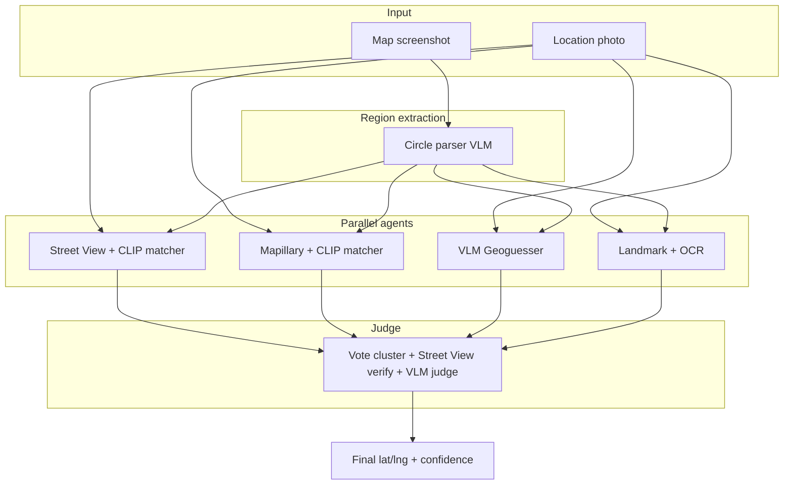

# doordash-geo-hunt

Multi-agent geolocation pipeline for DoorDash FIFA ticket contest drops.

Given two contest images:
1. **Map photo** — circular search region
2. **Location photo** — bag on pedestal + background clues

…the system runs **4 agents in parallel**, then a **judge agent** picks the final lat/lng.

## Architecture



### Agent 1 — Street View matcher (your original idea)
- Grid-sample Google Street View inside the circle
- 4 headings per panorama (0°, 90°, 180°, 270°)
- CLIP embedding similarity vs cropped location background

### Agent 2 — Mapillary matcher
- Same CLIP pipeline on Mapillary street-level photos
- Often captures angles Google lacks (parking lots, alleys)

### Agent 2b — KartaView matcher (public, no API key)
- Uses `POST https://api.openstreetcam.org/1.0/list/nearby-photos/`
- Queries by circle center + radius, capped at 120 frames
- Same CLIP matching as Mapillary
- Note: older image CDN links sometimes 404/502; those frames are skipped automatically

### Agent 3 — VLM Geoguesser
- Vision LLM reads architecture, storefronts, skyline
- Proposes lat/lng candidates constrained to the circle

### Agent 4 — Landmark + OCR
- EasyOCR on visible text + VLM POI matching
- Good when a sign or store name peeks behind the bag

### Judge agent
- Filters candidates outside the circle
- Clusters nearby duplicates; boosts multi-agent agreement
- Re-fetches Street View at top candidates
- Vision LLM compares location photo vs Street View panels

## API keys

Copy `.env.example` → `.env`:

| Key | Used by | Notes |
|-----|---------|-------|
| `GOOGLE_MAPS_API_KEY` | Agents 1, judge | Enable Street View Static + Metadata |
| `MAPILLARY_ACCESS_TOKEN` | Agent 2 | Free developer tier |
| *(none)* | KartaView agent | Public API — no key needed |
| `CURSOR_API_KEY` | Agents 3–4, judge, map parser | Uses Cursor credits |
| `OPENAI_API_KEY` | Optional fallback | GPT-4o vision if you prefer |

### Other APIs worth adding later
- **Google Places / Geocoding** — validate OCR text → POI inside circle
- **Bing Maps Streetside** — extra street-level coverage in some cities
- **KartaView / OpenStreetCam** — additional free imagery
- **LoFTR / SuperGlue** — keypoint matcher when CLIP is ambiguous (narrow downtown scenes)

## Setup

```powershell
cd C:\Users\91767\Projects\doordash-geo-hunt
python -m venv .venv
.\.venv\Scripts\Activate.ps1
pip install -e .
copy .env.example .env
# edit .env with your keys
```

## Run

**One command from a tweet URL** (ingest + full pipeline):

```powershell
python cli.py ingest "https://x.com/DoorDash/status/TWEET_ID" --out samples/live-drop --run --tweet-id
```

Ingest only (download photos):

```powershell
python cli.py ingest "https://x.com/DoorDash/status/TWEET_ID" --out samples/live-drop
```

Manual photos:

```powershell
python cli.py run `
  --map samples/run1/photo2.jpg `
  --location samples/run1/photo3.jpg `
  --city "Miami" `
  --output-json output/run1.json
```

Legacy flags still work: `python cli.py --map ... --location ...`

### Contest day from phone (cursor.com/agents)

1. Push this repo to GitHub; connect it to Cloud Agents.
2. Add cloud secrets (same keys as `.env.example` — Bedrock, Google Maps, Mapillary).
3. On [cursor.com/agents](https://cursor.com/agents), start an agent on this repo.
4. Paste the prompt from `.cursor/agents/contest-day-prompt.txt` and replace `PASTE_URL_HERE` with the tweet link.

**In parallel:** open Cursor chat on phone (Opus 4.8), save tweet photos 2+3, attach for a faster first pin while the cloud agent runs.

Optional webhook automation: `.cursor/automation/door-dash-drop.json`

Manual circle (skip map VLM):

```powershell
python cli.py `
  --map samples/run1/map.jpg `
  --location samples/run1/location.jpg `
  --center-lat 30.2672 `
  --center-lng -97.7431 `
  --radius-m 600
```

## Output

- Console report with per-agent top candidates
- `output/result.json` with full structured results + Street View link

## Phase 2 (next)

- Cursor SDK orchestrator spawning subagents as separate runs
- Twitter/X auto-fetch when contest posts drop
- LoFTR reranker on top-20 CLIP hits
- SAM-based bag removal for cleaner background matching

## Cost tips

- Start with `--center-lat/lng/radius` to skip map VLM call
- Reduce Street View grid: edit `step_m` in `visual_matcher.py` (40m default)
- Run only visual agents first; add VLM agents if CLIP disagrees
