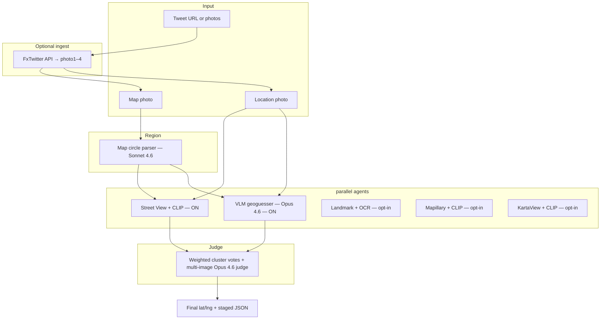

# doordash-geo-hunt

Multi-agent geolocation pipeline for DoorDash FIFA ticket contest drops.

Given a **map photo** (red warm-zone circle) and a **location photo** (bag on pedestal + background clues), the system runs **agents in parallel** (default: Street View + VLM), emits **staged verdicts (P1/P2/P3)** automatically, then a **judge** picks the final lat/lng.

## Quick start (contest day)

```powershell
# Morning: warm CLIP/torch weights (NOT Street View images)
python cli.py prewarm

# Drop: ingest photos + run staged parallel pipeline
python cli.py ingest "https://x.com/DoorDash/status/TWEET_ID" `
  --out samples/live-drop --run --tweet-id `
  --agents streetview,vlm --staged --staged-parallel `
  --sv-workers 32 --sv-max-frames 1000 --clip-batch-size 32
```

The run prints three verdicts without any further interaction:
**P1 (fast, VLM)** → **P2 (CLIP/Street View)** → **P3 (final, judge)**.

DoorDash posts **4 photos** per drop. This project uses:

| File | Role |
|------|------|
| `photo1.jpg` | Promo (ignore) |
| **`photo2.jpg`** | **Map / warm zone** |
| **`photo3.jpg`** | **Location clue** |
| `photo4.jpg` | Promo (ignore) |

**Phone workflow:** paste tweet URL + prompt from [`.cursor/agents/contest-day-prompt.txt`](.cursor/agents/contest-day-prompt.txt) into [cursor.com/agents](https://cursor.com/agents). In parallel, attach photos 2+3 in Cursor chat (Opus 4.8) for a faster first pin.

---

## Architecture



### Agents

Default contest roster is `streetview,vlm`. The others are opt-in via `--agents`.

| Agent | Default | Method | API |
|-------|---------|--------|-----|
| **streetview_matcher** | **ON** | Coarse→fine→refine grid → Google Street View → batched CLIP | `GOOGLE_MAPS_API_KEY` |
| **vlm_geoguesser** | **ON** | Vision LLM reads scene → lat/lng inside circle | Bedrock / Azure / Gemini |
| **landmark_ocr** | off | EasyOCR (promo-word blocklist) + vision LLM POI matching | Bedrock / Azure / Gemini |
| **mapillary_matcher** | off | Bbox street photos → CLIP | `MAPILLARY_ACCESS_TOKEN` |
| **kartaview_matcher** | off | OpenStreetCam nearby photos → CLIP | None (public API) |

### Street View coarse→fine→refine

| Pass | Grid | Headings | FOV | Budget |
|------|------|----------|-----|--------|
| 1 coarse | `max(60, radius/10)` m | 8 (45°) | 120° | 50% of `--sv-max-frames` |
| 2 fine | 60 m around top-5 coarse hits | 12 (30°) | 90° | remaining |
| 3 refine | top-3 panos | ±`--sv-refine-span` in `--sv-refine-step` steps + pitch | 90° | ≤50 frames |

Metadata and image fetches run on a shared connection-pooled `httpx.Client` across `--sv-workers` threads; panoramas are deduped by `pano_id`; CLIP embeds are batched (`--clip-batch-size`). No frames are written to disk unless `--sv-cache` (dev only).

### Judge

1. Drop candidates outside the search circle.  
2. Weighted cluster within **150 m** (VLM ×1.1, Street View ×1.0; flat-CLIP hits down-ranked); agreement boost `1 + 0.2·(agents−1)`.  
3. Fetch Street View panels for the top 2 candidates **in parallel** and attach them (clue photo + panels) to one multi-image Opus call.  
4. Out-of-circle LLM answers snap to the top cluster and clamp confidence; `human_review` flips on when confidence < 0.6 or top candidates disagree > 200 m.  

### Vision LLM routing (`llm_vision.py`)

Tiered by step (configurable via env):

| Step | Default model tier |
|------|-------------------|
| Map circle | **Sonnet 4.6** |
| Landmark + OCR | **Sonnet 4.6** |
| VLM geoguesser | **Opus 4.6** (falls back to Opus 4.5 on Bedrock if 4.6 unavailable) |
| Judge | **Opus 4.6** (same fallback) |

Set `VISION_LLM_PROVIDER=bedrock` (recommended), `gemini`, `azure_openai`, `openai`, or `anthropic`. See [`.env.example`](.env.example).

---

## Setup

**Requires Python 3.10+** (3.11 recommended).

```powershell
cd C:\Users\91767\Projects\doordash-geo-hunt

# Option A: conda (recommended on Windows)
conda create -n geo-hunt python=3.11 -y
conda activate geo-hunt

# Option B: venv
python -m venv .venv
.\.venv\Scripts\Activate.ps1

pip install -e .
copy .env.example .env
# Edit .env with your API keys
```

Verify keys:

```powershell
python scripts/test_apis.py
```

---

## Configuration

Copy [`.env.example`](.env.example) → `.env`. Minimum for Bedrock pipeline:

```env
VISION_LLM_PROVIDER=bedrock
GOOGLE_MAPS_API_KEY=...
MAPILLARY_ACCESS_TOKEN=...
AWS_BEARER_TOKEN_BEDROCK=...
AWS_BEDROCK_REGION=us-east-1
AWS_BEDROCK_SONNET_MODEL_ID=us.anthropic.claude-sonnet-4-6
AWS_BEDROCK_OPUS_MODEL_ID=us.anthropic.claude-opus-4-6
AWS_BEDROCK_OPUS_FALLBACK_MODEL_ID=us.anthropic.claude-opus-4-5-20251101-v1:0
```

| Key | Used by |
|-----|---------|
| `GOOGLE_MAPS_API_KEY` | Street View grid, judge metadata |
| `MAPILLARY_ACCESS_TOKEN` | Mapillary CLIP agent |
| `AWS_BEARER_TOKEN_BEDROCK` | All vision LLM steps (when `VISION_LLM_PROVIDER=bedrock`) |
| KartaView | No key — public API |
| `GEMINI_API_KEY` | Alternative vision provider |
| `AZURE_OPENAI_*` | Alternative vision provider (deploy Sonnet + Opus) |

**Never commit `.env`** — it is gitignored.

---

## Run

### Tweet ingest + pipeline (one command)

```powershell
python cli.py ingest "https://x.com/DoorDash/status/TWEET_ID" `
  --out samples/live-drop `
  --run --tweet-id `
  --agents streetview,vlm --staged --staged-parallel
```

Uses **FxTwitter / VxTwitter API** — does not scrape x.com in a browser. Photos are
downloaded in parallel (`--ingest-workers`) with retry, then classified (map vs clue).

### Ingest only

```powershell
python cli.py ingest "https://x.com/DoorDash/status/TWEET_ID" --out samples/live-drop
```

### Manual photos

```powershell
python cli.py run `
  --map samples/miami-drop1/photo2.jpg `
  --location samples/miami-drop1/photo3.jpg `
  --city Miami `
  --output-json output/miami-drop1.json
```

### Skip map LLM (manual circle)

```powershell
python cli.py run `
  --map samples/miami-drop1/photo2.jpg `
  --location samples/miami-drop1/photo3.jpg `
  --center-lat 25.814 `
  --center-lng -80.197 `
  --radius-m 800 `
  --output-json output/manual.json
```

Legacy syntax still works: `python cli.py --map ... --location ...`

### Prewarm (morning of contest)

```powershell
python cli.py prewarm          # loads CLIP + torch
python cli.py prewarm --ocr    # also warms EasyOCR (only if using --agents landmark)
```

`prewarm` loads model weights only. It does **not** pre-cache Street View images — the
drop circle is unknown until the tweet ingests and changes daily.

### CLI reference (run / ingest --run)

| Flag | Default | Purpose |
|------|---------|---------|
| `--agents` | `streetview,vlm` | Comma list: `streetview,vlm,landmark,mapillary,kartaview` |
| `--staged` / `--no-staged` | on | Emit P1/P2/P3 verdicts automatically |
| `--staged-parallel` / `--no-staged-parallel` | on | VLM + Street View start together |
| `--stage {1,2,3}` | – | Debug a single stage (1=VLM, 2=+CLIP, 3=full) |
| `--sv-workers` | `min(32, cpu×4)` | Street View HTTP/CLIP parallelism |
| `--clip-batch-size` | 32 | CLIP embed batch size |
| `--ingest-workers` | 4 | Parallel photo downloads |
| `--judge-workers` | 4 | Parallel judge panel fetch |
| `--sv-coarse-fine` / `--no-sv-coarse-fine` | on | 3-pass coarse→fine→refine |
| `--sv-headings-coarse` / `--sv-headings-fine` | 8 / 12 | Headings per pass |
| `--sv-headings` / `--sv-heading-step` | – | Override heading count (coarse-fine off) |
| `--sv-refine-headings` / `--no-sv-refine-headings` | on | Pass-3 heading+pitch sweep |
| `--sv-refine-span` / `--sv-refine-step` | 30 / 10 | Refine sweep window (degrees) |
| `--sv-pitch-refine` | `0,-10` | Pitches for the refine pass |
| `--sv-max-frames` | 1000 | Hard cap on fetched frames |
| `--sv-step-m` | – | Override pass-2 grid step |
| `--sv-cache` | off | Dev only: write SV frames to disk |
| `--agent-timeout-streetview/vlm/landmark` | 900/90/120 | Per-agent timeout (s) |

---

## Contest day (phone + cloud)

1. **Push repo to GitHub** and connect it in [Cursor Cloud Agents](https://cursor.com/dashboard).  
2. Add **cloud secrets** — see [`.cursor/agents/cloud-secrets-setup.md`](.cursor/agents/cloud-secrets-setup.md) (dashboard env vars, **not** `.env`).  
3. Verify in a cloud agent: `python3 scripts/test_apis.py` → Google + Bedrock OK.  
4. On [cursor.com/agents](https://cursor.com/agents), start an agent on this repo.  
5. Paste [`.cursor/agents/contest-day-prompt.txt`](.cursor/agents/contest-day-prompt.txt) with the tweet URL.  
6. **In parallel:** Cursor chat (Opus 4.8) with saved photos 2+3 for a fast pin.

Optional webhook automation: [`.cursor/automation/door-dash-drop.json`](.cursor/automation/door-dash-drop.json)

---

## Output

Staged runs print **three** verdict blocks (P1 fast / P2 CLIP / P3 final) and write four JSON files:

```
output/<id>_p1_fast.json     # VLM-only fast pin (provisional)
output/<id>_p2_clip.json     # VLM + Street View interim (provisional)
output/<id>_p3_final.json    # judged final
output/<id>.json             # copy of the final verdict
```

Each verdict carries `stage`, `provisional`, `agents_pending`, `human_review`,
`low_confidence`, `agreement_votes`, `alternatives`, and a `maps_url`.

```json
{
  "stage": "p3_final",
  "provisional": false,
  "human_review": false,
  "region": { "center_lat": 25.814, "center_lng": -80.197, "radius_m": 800 },
  "agents": [ ... ],
  "verdict": { "lat": 25.8142, "lng": -80.1969, "confidence": 0.88, "agreement_votes": 2 }
}
```

---

## Samples

| Folder | Description |
|--------|-------------|
| `samples/miami-drop1/` | Design District drop (tweet `2067973011781607579`) |
| `samples/miami-drop2/` | Brickell drop (tweet `2068028794883997721`) |
| `samples/live-drop/` | Default output for contest-day ingest |

Test on Miami drop 1:

```powershell
python cli.py run `
  --map samples/miami-drop1/photo2.jpg `
  --location samples/miami-drop1/photo3.jpg `
  --city Miami `
  --output-json output/2067973011781607579.json
```

---

## Scripts

| Script | Purpose |
|--------|---------|
| `scripts/test_apis.py` | Smoke-test all API keys |
| `scripts/probe_models.py` | Test Bedrock vision models |
| `scripts/probe_bedrock_models.py` | Quick Bedrock model ID probe |
| `scripts/trigger-drop-webhook.ps1` | POST tweet URL to automation webhook |

---

## Tests

```powershell
pip install -e ".[dev]"
pytest -q
```

Covers heading propagation, percentile confidence, OCR blocklist, region filtering,
pano dedup, preprocessing shape hardening, photo classification, and city parsing.

---

## Known limitations

- **Opus 4.6** may not be available on all Bedrock accounts — auto-falls back to Opus 4.5.  
- **Mapillary / KartaView** are off by default (flaky CDNs); enable via `--agents`.  
- **CLIP precision ceiling** = panorama spacing. CLIP picks the best-matching pano; the refine pass (heading+pitch) tightens the aim but cannot triangulate a sub-pano point. Weak/generic clues → `human_review` is flagged rather than a falsely confident pin.  
- **Tweet ingest** requires FxTwitter/VxTwitter; if down, save photos manually from the X app and use `python cli.py run --map ... --location ...`.  
- **Gemini free tier** may hit quota (429) — use Bedrock as primary (`VISION_LLM_PROVIDER=bedrock`).

---

## Cost tips

- Use `--center-lat/lng/radius` to skip map vision LLM call  
- Increase Street View grid step in `streetview.py` to reduce API calls  
- Sonnet for map/OCR + Opus for geoguesser/judge is the default cost/quality balance  

---

## Project layout

```
cli.py                          # Entry point (run / ingest / prewarm)
src/doordash_geo_hunt/
  orchestrator.py               # Staged parallel runner + judge + staged JSON
  pipeline_context.py           # PipelineContext + StreetViewConfig
  twitter_fetcher.py            # Tweet → photo1–4 (parallel) + classifier
  llm_vision.py                 # Tiered vision LLM router + multi-image
  map_extractor.py              # Map circle → SearchRegion
  streetview.py                 # 3-phase parallel Street View client
  agents/visual_matcher.py      # CLIP matchers (coarse→fine→refine)
  agents/vlm_agents.py          # Geoguesser + landmark/OCR
  judge/judge_agent.py          # Weighted cluster + multi-image judge
  matching/clip_matcher.py      # Local CLIP embeddings (batched)
tests/                          # Regression tests (pytest)
.cursor/agents/                 # Contest-day cloud agent prompt
.cursor/automation/             # Webhook automation prefill
samples/                        # Miami test drops
```

---

## License

Private / personal use. API keys and contest photos are your responsibility.
